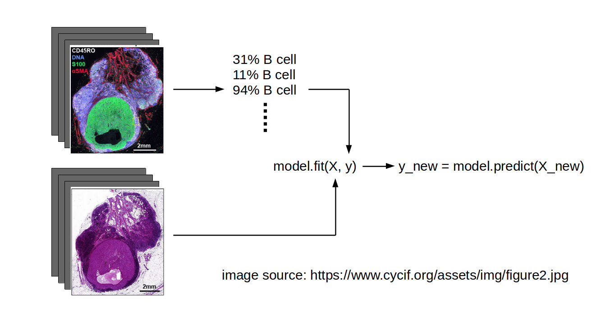

# CyCIF, H&E, machine learning
Cross-registration of CyCIF and H&E images for multi-modal knowledge integration, with applications in machine learning.

## Background
Multiplex biomedical imaging technology like CyCIF contains rich information in the channels, usually antibody targeting specific protins/biomolecules. On the other hand, pathologists have accumulated legacy knowledge capable of making therapeutic decisions based on low-dimension but texture-rich H&E images. An unified knowledge framework across molecular/cell biology and pathology will translate clinical significance to distributions of biomolecules and cell types, as well as point out molecular evidence that didn't incur morphology changes for clinical investigation.

## Stages
- [x] Automatic cross-registration between CyCIF and H&E images from adjacent sections of the same biospecimen  
- [ ] Infer molecular/cell biology (derived from CyCIF images) from H&E images  
- [ ] Infer texture information (derived from H&E images) from CyCIF images  

Fig: Example machine learning scheme, predicting B cell fractions using H&E images along, with labels generated from CyCIF image of adjacent sections. Idea from Ru.

## Resources
* Install SimpleElastix on HMS O2 server ([gist](https://gist.github.com/hungyiwu/72f47365a4b3e9d0626467a9fd0aab9d))
* DeepCell ([website](https://deepcell.org))
